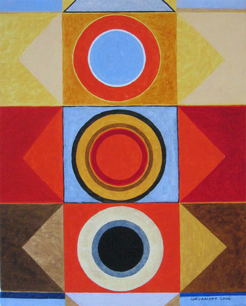

# Recreación obra "Tres"

## Información de la obra
- **Nombre:** Tres  
- **Autor:** Iordanov  

### Imagen original

---

## Proceso de trabajo

### Elección de la obra
Elegí esta obra basandome en que su composición geométrica era clara, con formas como rectángulos, triángulos y círculos,formas simples, pero organizadas de manera compleja. También me llamo la atención la paleta de colores y el como estaban organizados estos elementos dentro del lienzo

### Análisis de la obra
Primero observé la obra para identificar que la composición está organizada en filas horizontales y en una estructura central simétrica.
También analicé la paleta de colores, notando que hay una paleta limitada pero con alto contraste entre tonos cálidos y fríos. Esto fue importante para lograr una representación fiel.
En cuanto a proporciones, me fijé en cómo se divide el espacio del lienzo, especialmente en la relación entre las secciones superiores, centrales y inferiores.

### Traducción a código
Para este paso primero cambie el tamaño de mi lienzo al mismo tamaño de la obra, utilice Photoshop para obtener las medidas de las posiciones de cada elemento, esto lo hice con la herramienta regla y comencé a ubicar cada forma utilizando coordenadas X e Y con las medidas exactas indicadas. Los colores los identifique con el cuentagotas.
Fui fila por fila, ubicando primero los rectángulos de fondo y luego las figuras más complejas encima, respetando el orden de dibujo (capas), asi también manteniendo un orden de lectura.

### Decisiones de código
En algunos casos reemplacé rectángulos delgados por líneas, utilizando `strokeWeight` para mantener el grosor. Esto simplificó el código sin perder la función visual.

### Dificultades
Tuve dificultades con la posición de algunas figuras, especialmente triángulos y círculos, ya que requerían mucha precisión.

### Soluciones
Fui ajustando manualmente los valores y usando referencias visuales para lograr mayor precisión.

---

## Documentación visual

### Proceso

### Resultado final

---

## Link al sketch en p5.js

[Ver sketch](https://editor.p5js.org/sofia.salvo/sketches/8BLUy8fKV)

