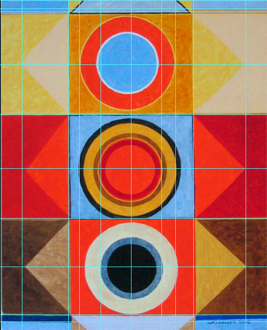
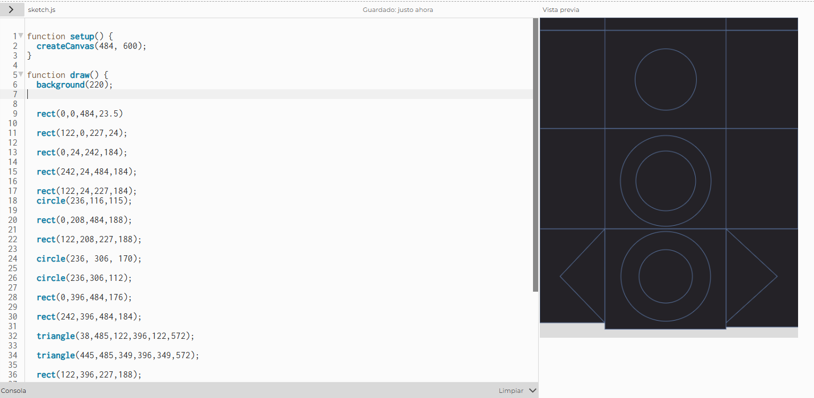
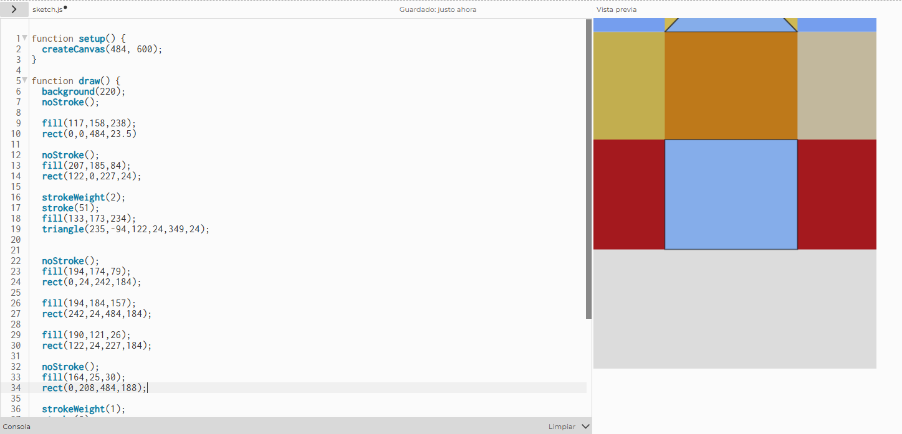
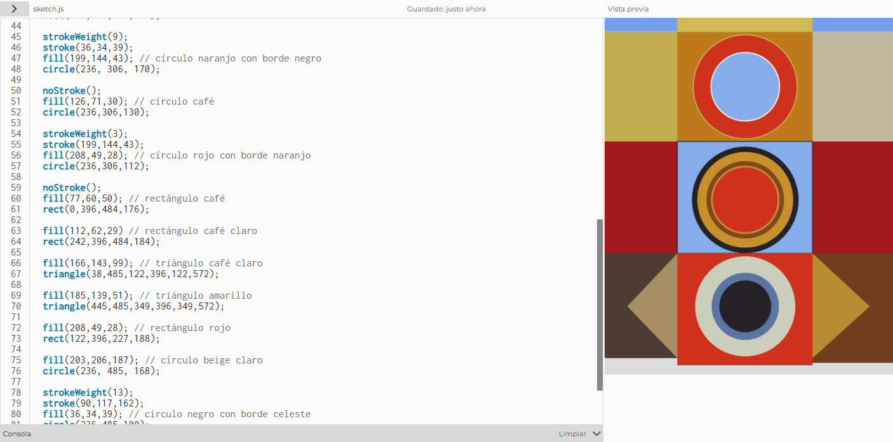
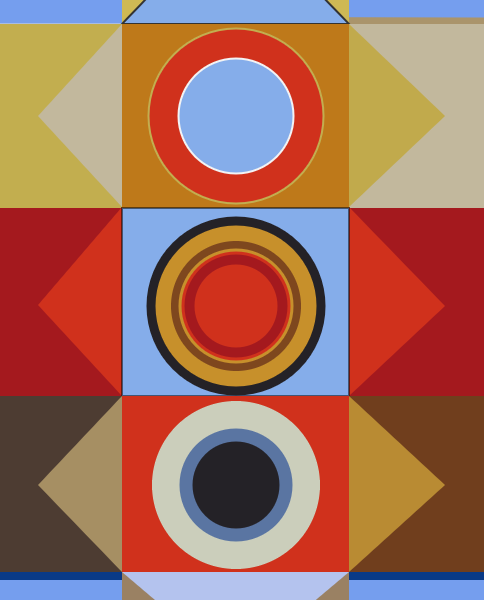

# Recreación obra "Tres"

## Información de la obra
- **Nombre:** "Tres" - 2006
- **Autor:** Jérémie Iordanoff  

### Imagen original

---

## Proceso de trabajo

### Elección de la obra
Elegí esta obra basandome en que su composición geométrica era clara, con formas como rectángulos, triángulos y círculos,formas simples, pero organizadas de manera compleja. También me llamo la atención la paleta de colores y el como estaban organizados estos elementos dentro del lienzo

### Análisis de la obra
Primero observé la obra para identificar que la composición está organizada en filas horizontales y en una estructura central simétrica.
También analicé la paleta de colores, notando que hay una paleta limitada pero con alto contraste entre tonos cálidos y fríos. Esto fue importante para lograr una representación fiel.
En cuanto a proporciones, me fijé en cómo se divide el espacio del lienzo, especialmente en la relación entre las secciones superiores, centrales y inferiores.

### Traducción a código
Para este paso primero cambie el tamaño de mi lienzo al mismo tamaño de la obra, utilice Photoshop para obtener las medidas de las posiciones de cada elemento, esto lo hice con la herramienta regla y comencé a ubicar cada forma utilizando coordenadas X e Y con las medidas exactas indicadas. Los colores los identifique con el cuentagotas.
Fui fila por fila, ubicando primero los rectángulos de fondo y luego las figuras más complejas encima, respetando el orden de dibujo (capas), asi también manteniendo un orden de lectura.

### Decisiones de código
En algunos casos reemplacé rectángulos delgados por líneas, utilizando `strokeWeight` para mantener el grosor. Esto simplificó el código sin perder la función visual. Tambien decidí hacer los círculos con bordes en vez de solo círculos para que quedara igual a la imagen original, así poder simplificar los codigos y se viera mucho más ordenado 

### Dificultades
Lo que mas me  dificulto de este trabajo fue lograr que las proporciones coincidieran con las de la imagen original. Por algun pequeño error en las coordenadas hacía que la composición se viera desalineada y no quedaba identico al de la imagen original.
También los triángulos se me dificultaron bastante más que otras figuras, ya que requieren coordinar tres puntos con precisión.
Otro desafío fue trabajar con los círculos centrales, especialmente al combinar relleno y borde para que se parecieran al original.

### Soluciones
Pude ir resolviendo este tipo de problemas ajustando manualmente los valores de aquellas figuras que no me convencia su ubicación y usando las referencias de p5js para lograr mayor precisión.

---

## Documentación visual
### Metodología

### Proceso

### Resultado final

---

## Link al sketch en p5.js

[Ver sketch](https://editor.p5js.org/sofia.salvo/sketches/8BLUy8fKV)

